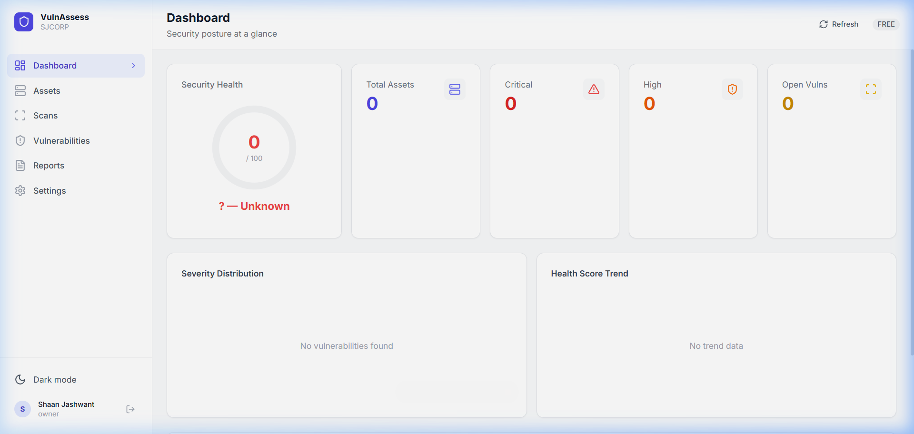
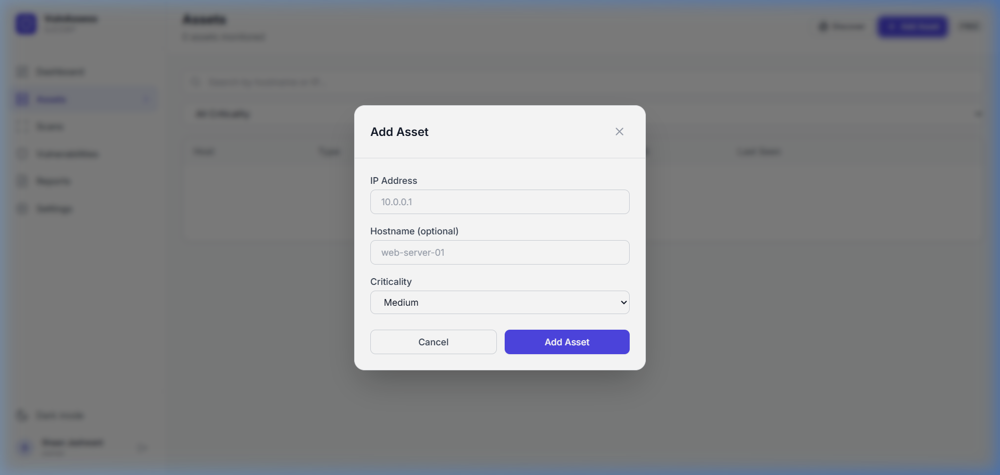
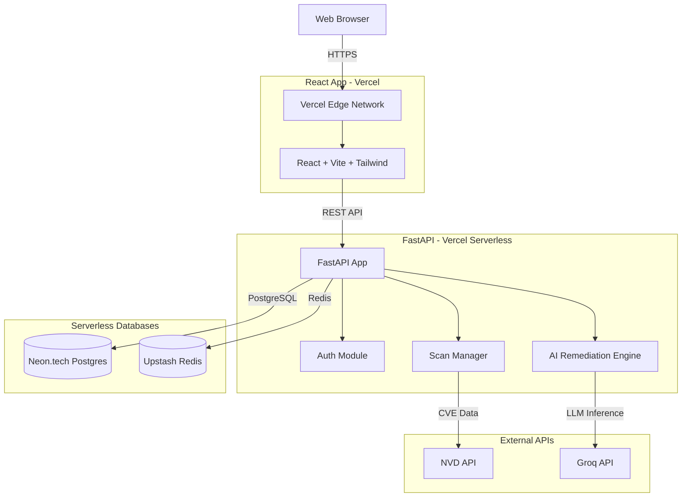

# VulnAssess Platform

[](https://github.com/sjashwant21/vuln-platform/actions/workflows/ci.yml)
[](https://opensource.org/licenses/MIT)

An AI-Powered Vulnerability Assessment Platform designed to help security teams identify, analyze, and remediate infrastructure vulnerabilities.

> **Note:** This project is actively developed and currently fully functional in production.

## Features

- **Automated Scanning:** Integrate with Nmap and NVD databases to discover open ports and vulnerabilities.
- **AI-Powered Remediation:** Leverages Groq's Llama 3 models to suggest precise, actionable fixes for discovered CVEs.
- **Asset Management:** Track servers, endpoints, and web applications.
- **Role-Based Access Control:** Secure multi-tenant architecture.
- **PDF Reporting:** Generate executive and technical security reports automatically.

## Screenshots

<div align="center">
  
  <br/>
  <em>Main Security Dashboard Overview</em>
</div>

<div align="center">
  
  <br/>
  <em>Adding a New Asset for Vulnerability Scanning</em>
</div>

## Architecture



## Quick Start (Local Development)

### Prerequisites
- Docker and `docker compose`
- Python 3.12+ (managed via `uv`)
- Node.js 22+

### Setup

1. **Clone the repository:**
   ```bash
   git clone https://github.com/sjashwant21/vuln-platform.git
   cd vuln-platform
   ```

2. **Environment Variables:**
   Copy the example environment file and fill in your keys:
   ```bash
   cp .env.example .env
   ```
   *You will need a Groq API Key and NVD API Key.*

3. **Start the backend with Docker:**
   ```bash
   make up
   make migrate
   ```

4. **Start the frontend:**
   ```bash
   cd frontend
   npm install
   npm run dev
   ```

## Security & Disclosure

Please refer to [SECURITY.md](SECURITY.md) for vulnerability disclosure procedures. Do not report security bugs in public issues.

## License

This project is licensed under the [MIT License](LICENSE).
